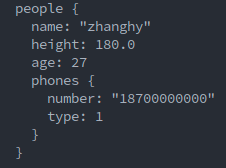

## Protocol Buffer Basics(C++ 和 Python):
本文旨在解释利用google Protobuf 进行数据的编解码应用，文中使用的message采用[官方教程](https://developers.google.com/protocol-buffers/docs/cpptutorial)中的地址簿，本教程参考
[How to use Protobuf for data interchange](https://opensource.com/article/19/10/protobuf-data-interchange#:~:text=At%20the%20implementation%20level%2C%20Protobuf,a%20language%2Dspecific%20data%20structure.)，原文使用Go和Java语言来展示不同语言的编解码过程，而本文采用自己更加常用的C++和Python语言进行编解码过程。
### 利用Protobuf在不同平台和不同语言间的数据传输过程


- 根据具体的使用场景编写特定的.proto文件
```proto
syntax = "proto3";

package example;//package name for avoiding name conflict

message Person{
    string name =1;//encoding suquence length
    float height = 2;//encoding fixed length
    int32 age = 3;////encoding varint length
    
    repeated PhoneNumber phones = 5;//"repeated" indicate that the "Person" message consists of repeated (none or more) "PhoneNumber" message 
    
    message PhoneNumber
    {
        string number = 1;
        int32 type = 2;
    }

}
message AddressBook
{
    repeated Person people = 1;
}
```

- 将.proto生成特定语言能够使用的数据结构
```shell
protoc --cpp_out=. example.proto  //生成example.pb.h 和example.pb.cc文件
protoc --python_out=. example.proto  //生成example_pb2.python文件
```
- C++利用自动生成的数据结构代码进行数据编码（代码片段）,Protobuf采用的是字节流编解码，因此相比于XML和JSON格式的编解码占用更小的存储，[这个博客](https://opensource.com/article/19/10/protobuf-data-interchange#:~:text=At%20the%20implementation%20level%2C%20Protobuf,a%20language%2Dspecific%20data%20structure.)对这三种编码格式进行了比较。本文中是将编码后的二进制文件保存在本地(encoding_cpp.pbuf)，然后使用Python读取该文件，这一过程与网络传输的过程类似。
```cpp
//fill velues of data
    example::AddressBook address_book;
    example::Person *person = address_book.add_people();
    person->set_name("zhanghy");
    person->set_age(27);
    person->set_height(180.0);

    example::Person_PhoneNumber *number = person->add_phones();
    number->set_number("18700000000");
    number->set_type(1);

    //encoding data and write to local file(the same approach would be used to write the data to the output stream of a network connection.)
    std::fstream f_out("../encoding_cpp.pbuf", std::ios::out | std::ios::trunc | std::ios::binary);
    if (!address_book.SerializePartialToOstream(&f_out))
    {
        std::cerr << "Failed to write adress book" << std::endl;
    }
```
- 利用Pythond解析本地文件(encoding_cpp.pbuf)并且打印
```python
import example_pb2

if __name__ == "__main__":
	file_name = "./encoding_cpp.pbuf"
	address_book_from_file = example_pb2.AddressBook()
	with open(file_name,"rb") as f:
		address_book_from_file.ParseFromString(f.read())

	print(address_book_from_file)
```
运行结果:


